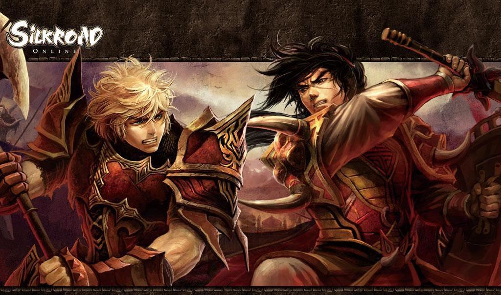

# [Silkroad Developer Community (SDC)](https://silkroad-developer-community.github.io/)

[Website](https://silkroad-developer-community.github.io) - [Join Discord](https://discord.gg/FEmNcz7QwP) - [GOVERNANCE](https://github.com/Silkroad-Developer-Community/GOVERNANCE) - [CODE OF CONDUCT](https://github.com/Silkroad-Developer-Community/.github/blob/main/CODE_OF_CONDUCT.md)

## Community Resources

- **[Contributing](https://github.com/Silkroad-Developer-Community/.github/blob/main/CONTRIBUTING.md)**: Help us build the future of Silkroad development.
- **[Support](https://github.com/Silkroad-Developer-Community/.github/blob/main/SUPPORT.md)**: Need help? Join our community or report issues.
- **[Security Policy](https://github.com/Silkroad-Developer-Community/.github/blob/main/SECURITY.md)**: How to report vulnerabilities safely.

> [!IMPORTANT]
> This community is not affiliated with, authorized, or endorsed by Joymax, WeMadeMax, or any official Silkroad Online developers. Some assets used in this community's projects may originate from the game itself. For any copyright concerns or takedown requests, please contact us.
